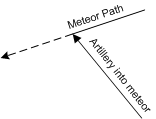
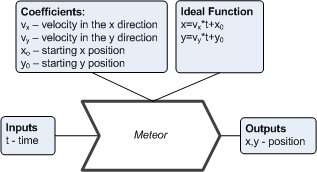
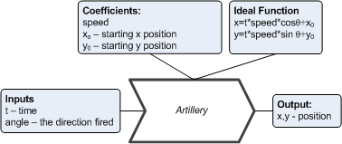

Meteor Defense
====================

This is a program learn how to use vectors in a simple game… and to become familiar with getting an Xcode project up and running.  The contest is to write a procedure that
shoots down a meteor.

The Task
--------

The problem is a warm up exercise, mostly focused on getting used to programming the C-language.

The exercise is to write a procedure **targetArtillery()** that decides a how to shoot an meteor before it hits the ground.
The procedure is given the location of the artillery canon, and the meteor's position and velocity.
It computes how to shoot, by computing artillery's velocity.  When it has done so, it sets two global
variables with the results:

* *artillery_v_x*  is the x velocity to shoot
* *artillery_v_y*  is the y velocity to shoot

The procedure has access to the global state of the game, but it is not allowed to change any.  These
state variables are:

* *artillery_x0*  is the artillery's starting x position
* *artillery_y0*  is the artillery's starting y position
* *meteor_x0*     is the meteor's starting x position
* *meteor_y0*     is the meteor's starting y position
* *meteor_v_x*     is the meteor's starting x position
* *meteor_v_y*     is the meteor's starting y position

### Steps to solve the challenge

In this section I'm going to give a walk-thru in the steps of solving the problem (and generally how to set
of the software to meet challenges in games like this.)

This game is intended to be a straight-forward learn-the-language task, and how to structure the relevant math
in the game.  This problem doesn't rely too heavily on deriving the equations -- but you're expected to work out
how to get them into the computer program appropriately.

I will use diagrams; it's tempting to dismiss them, as they are "just" pictures.  Do not.  They help break the problem
down, make it easily solvable (or at least, easier to solve), organize the information you need, and help reduce mistakes.

#### Step 1: Diagram the situation

The first step is diagram the basic event that is happening: the who's, the when's, and the where's.
The objective is to shoot an meteor before it hits the ground.  So the "who's" are a meteor and a bullet (which I'm
calling an artillery.).  The where's is the place they hit each other.  And the "when" is the point in time they intersect:

#### Step 2: Describe each of the objects

The next step is to describe the meteor and it's flight.

And the artillery:

#### Step 3: Solve the equations, and implement it in code

Pick a time before the meteor will hit the ground.  In the simple challenge, the meteors never hit the ground before t=1.0.
So let's pick a time such as t=0.5 and intercept the meteor there.

1. Calculate where the meteor be at t=0.5
2. Calculate the vector from artillery starting point to where the meteor will be
3. Divide that t=0.5.  Why do we have to do this?  The vector says how far (and which direction) the artillery has to go, but not how long.   So we need to divide it by the amount of time it has to get there.

I'm not going to give explicit steps how to make this algebra, nor am I going to give explicit steps on how to code it.
That's _your_ job.

Requirements
---------------
The was created using the Xcode editor running under Mac OS X 10.8.x or later. 

